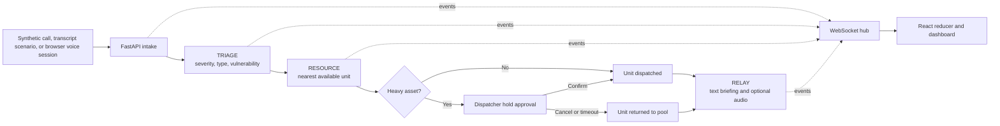

# Clear Dispatch

Clear Dispatch is a local emergency-dispatch simulation that classifies synthetic calls, assigns response units, requests human approval for heavy assets, and streams the resulting state to a dispatcher dashboard.

> [!WARNING]
> This is a prototype built with synthetic scenarios and in-memory state. It is not connected to 911 telephony, a computer-aided dispatch system, or authoritative incident data. Do not use it for real emergencies.

**Current status:** the dashboard and scripted demo run locally. There is no hosted deployment, production authentication, persistent database, automated unit-test suite, or declared software license. See [Validation and known issues](#validation-and-known-issues) for the checks performed on the current revision.

## What is implemented

- A FastAPI backend with a four-stage call pipeline: MONITOR, TRIAGE, RESOURCE, and RELAY.
- A React and TypeScript operations dashboard updated through WebSocket events.
- Assisted intake using five pre-recorded transcript scenarios.
- Surge intake through scripted calls or an ElevenLabs browser voice session.
- Nearest-unit selection using Haversine distance across 20 static response-unit fixtures.
- A blocking approval step before dispatching `air_tanker`, `heavy_rescue`, or `hazmat` units.
- Optional Anthropic classification and briefing generation, plus optional ElevenLabs text-to-speech.

The repository's strongest executable evidence is the scripted demo path. `POST /demo/start` injects two calls, `POST /demo/trigger-surge` injects four more, and the fourth surge call forces the heavy-asset approval flow. The dashboard exposes call updates, agent status, unit assignment, briefings, holds, and an audit trail as the backend broadcasts them.

## How it works



MONITOR samples the previous 60 seconds of call timestamps every 5 seconds. It changes from `ASSISTED` to `SURGE` when the count is greater than `SURGE_THRESHOLD`. It returns to `ASSISTED` when the current count is at or below the threshold and more than 120 seconds have elapsed since the surge began. The demo trigger sets Surge Mode directly rather than waiting for this detector.

Both modes use the same TRIAGE, RESOURCE, and RELAY pipeline. The main difference is intake: Assisted Mode can stream a selected transcript before the operator ends the call, while Surge Mode supports scripted bulk intake and a browser-based conversational voice agent.

## Technical highlights

| Area | Implementation |
| --- | --- |
| Model integration | TRIAGE requests structured JSON from Claude Haiku; RELAY requests a briefing of fewer than 25 words. Both paths have deterministic fallbacks when a request fails. |
| Safety checkpoint | RESOURCE reserves a heavy asset, emits `HOLD_REQUIRED`, and waits up to 60 seconds for explicit confirmation before dispatch. |
| Resource selection | Available units are filtered by heavy or standard type, then ranked by Haversine distance. ETA is a simple distance-at-80-km/h estimate, not a routing prediction. |
| Real-time UI | The backend emits typed JSON events over one WebSocket endpoint. A pure React reducer upserts calls and records user-visible audit entries. |
| Simulation | A background generator uses exponential inter-arrival times. Scripted endpoints provide repeatable two-call and four-call demonstrations. |
| Data handling | Calls, resources, holds, incidents, and logs remain in one Python process. `/demo/reset` clears session data and process restart clears everything. |

## Quick start

### Prerequisites

- Python 3.11+
- [uv](https://docs.astral.sh/uv/)
- Node.js 18+ and npm
- Optional: an Anthropic API key for model-generated triage and briefings
- Optional: an ElevenLabs API key for backend-generated briefing audio

### 1. Clone the repository

```bash
git clone https://github.com/aadityad12/Clear-Dispatch.git
cd Clear-Dispatch
```

### 2. Start the backend

```bash
cd signal/backend
cp .env.example .env
uv sync --locked
uv run python -m uvicorn main:app --reload --port 8000
```

In another terminal:

```bash
curl http://localhost:8000/health
# {"status":"ok","mode":"ASSISTED"}
```

The service can start without external API keys. Model calls then use their fallback values, and briefing audio remains disabled.

### 3. Start the frontend

```bash
cd signal/frontend
npm ci
npm run dev
```

Open the HTTPS URL printed by Vite, normally `https://localhost:5173`. Accept the local development certificate warning if your browser presents one. Vite proxies `/api`, `/audio`, and `/ws` to the backend on port 8000.

### 4. Run the scripted flow

1. Select **Reset** to clear calls, holds, incidents, and unit assignments.
2. Select **Start Demo** to inject two Assisted Mode calls.
3. Optionally choose one of the five transcript scenarios and select **Answer Call**, then **End Call** to hand it to the shared pipeline.
4. Select **Trigger Surge** to inject four rapid calls and enter Surge Mode.
5. Confirm or cancel the heavy-asset hold when it appears.
6. Select **Override** to return to Assisted Mode.
7. Press <kbd>A</kbd> to toggle the audit trail.

## Configuration

Backend settings are read from `signal/backend/.env`:

| Variable | Required | Default | Behavior |
| --- | --- | --- | --- |
| `ANTHROPIC_API_KEY` | No | Unset | Enables model-generated extraction, triage, and briefings. Failed or unavailable calls use fallback values. |
| `ELEVENLABS_API_KEY` | No | Unset | Enables backend briefing text-to-speech. It is not used to configure the browser conversational agent. |
| `ELEVENLABS_VOICE_ID` | No | `21m00Tcm4TlvDq8ikWAM` | Selects the ElevenLabs voice used for briefing audio. |
| `SURGE_THRESHOLD` | No | `10` | Number of calls in the 60-second window that must be exceeded to enter Surge Mode. |

The frontend has no required environment variables. The Surge Mode phone QR code requests the backend's `/ip` endpoint and falls back to the current browser hostname. It preserves the page protocol and port when constructing the `/sos` URL.

The browser conversational agent ID is currently embedded in `SosPage.tsx` and `VoiceAgentModal.tsx`. That integration also depends on the external agent remaining public and correctly configured in ElevenLabs.

## Technology stack

| Layer | Technology |
| --- | --- |
| Backend | Python 3.11, FastAPI, Uvicorn, Pydantic |
| AI integration | Anthropic Python SDK, Claude Haiku model identifier in source |
| Voice | ElevenLabs REST text-to-speech and `@elevenlabs/react` conversational sessions |
| Frontend | React 18, TypeScript, Vite 6 |
| Map | Leaflet with CARTO raster tiles |
| State and transport | In-memory Python collections, native WebSocket, React `useReducer` |

## Repository structure

```text
signal/
├── backend/
│   ├── agents/          # Monitor, triage, resource selection, and briefing stages
│   ├── data/            # Static units, vulnerability scores, polygon, and transcripts
│   ├── routers/         # Call, demo, hold, state, log, and voice-session endpoints
│   ├── ws/              # WebSocket connection manager
│   ├── main.py          # FastAPI service and background-task lifecycle
│   └── state.py         # Process-local mutable state
└── frontend/
    └── src/
        ├── components/  # Dashboard, modals, controls, map, and audit UI
        ├── hooks/       # Auto-reconnecting WebSocket client
        ├── pages/       # Phone SOS page
        └── store/       # WebSocket event reducer
```

FastAPI exposes interactive endpoint documentation at `http://localhost:8000/docs` while the backend is running. The canonical frontend event shapes are in `signal/frontend/src/types.ts`.

## Validation and known issues

Available repository checks are:

```bash
# Frontend type-check and production bundle
cd signal/frontend
npm run build

# Backend smoke flow, with the backend already running
cd ../..
PATH="$PWD/signal/backend/.venv/bin:$PATH" bash scripts/smoke_test.sh
```

There are no configured lint, backend unit-test, or frontend unit-test commands.

The following checks were run on the current revision on August 13, 2026:

| Check | Result |
| --- | --- |
| `uv sync --locked` | Passed a clean, locked backend dependency installation. |
| `npm ci` | Passed a clean, locked frontend dependency installation; npm reported 4 audit findings (1 low, 3 high). |
| `npm run build` | Passed TypeScript compilation and the Vite production build. |
| Backend import, bytecode compilation, startup, `/health`, and `/state` | Passed using the existing local virtual environment. `/state` loaded 20 units and one polygon feature. |
| Smoke test with the backend virtual environment on `PATH` | Passed all six stages, including health, reset, call intake, `CALL_ADDED`, `BRIEFING_READY`, demo endpoints, and queue population. |

Additional limitations:

- There are no unit or integration test files. The smoke script is the only checked-in executable validation.
- The smoke script opens its WebSocket after posting the test call, so the `CALL_ADDED` assertion remains timing-sensitive.
- The GitHub Actions workflow performs an automated pull-request review; it does not build or test the system.
- Static unit locations, vulnerability scores, transcripts, ETA calculations, and the simplified fire polygon are demonstration fixtures, not validated operational data.
- Standard units are assigned automatically. Only heavy asset types use the blocking hold approval flow.
- Backend-generated audio is exposed under `/audio`, but the current dashboard only marks it as available and does not start playback.
- The dashboard reducer does not rehydrate calls, holds, incidents, or agent status after a refresh; it rebuilds those views from new WebSocket events. `MapView` separately fetches `GET /state` for map fixtures.
- CORS accepts all origins, and the API has no authentication or authorization.
- The simulator posts to `localhost:8000`, so changing the backend port requires a code change.
- A clean `npm ci` currently reports 4 dependency audit findings (1 low, 3 high); these were not remediated as part of the documentation update.
- There are no releases, deployment configuration, hosted demo, benchmark results, or performance measurements in the repository.
- `signal/frontend/tsconfig.tsbuildinfo` is a tracked generated build artifact.

## Contributors and license

Clear Dispatch was created as a team project at HackDavis 2026. Repository history records contributions from:

- [Aaditya Desai](https://github.com/aadityad12)
- [Sheel Shah](https://github.com/shahxsheel)
- [Harish Thanigaivel](https://github.com/thanycodes)

See the [commit history](https://github.com/aadityad12/Clear-Dispatch/commits/main) and [contributors graph](https://github.com/aadityad12/Clear-Dispatch/graphs/contributors) for file-level attribution.

No license file is currently included. Without a license, reuse and redistribution rights are not granted by default.
